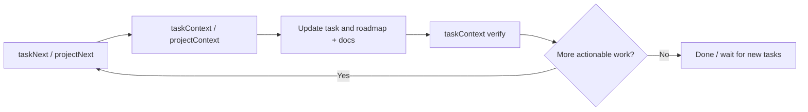

# Projitive

Language: English | [简体中文](README_CN.md)

Projitive is a governance model and MCP toolchain for Agent-driven delivery.

It helps teams turn "AI can code" into "AI can continuously deliver with traceability".

## Version

- Current spec: projitive-spec v1.0.0
- MCP package: @projitive/mcp (2.x line)

## 60-Second Start

If you only read one section, read this:

1. Start MCP: `npx -y @projitive/mcp`
2. Configure scan roots and depth in your MCP client
3. Run the loop: taskNext -> taskContext -> taskUpdate -> taskContext -> taskNext

Why teams use it:

- Faster next-task selection
- Clearer evidence traceability
- More stable multi-agent delivery loops

## Outcomes You Get

After onboarding Projitive, teams usually see these outcomes within the first iteration:

- Faster task bootstrapping: use taskCreate/roadmapCreate when no actionable task exists.
- Higher state consistency: task and roadmap transitions stay traceable and verifiable.
- More stable delivery rhythm: discover -> execute -> verify -> reprioritize stays continuous.
- Lower adoption friction: new contributors can follow a deterministic execution sequence.

Key point: best results come from pairing with autonomous execution agents, such as OpenClaw.

## What It Solves

Most agent workflows fail in project continuity, not coding ability.

Projitive fixes that with four constraints:

- State-first: explicit task states (`TODO`, `IN_PROGRESS`, `BLOCKED`, `DONE`)
- Evidence-first: transitions should be backed by designs/report/readme evidence
- Context-first: resolve governance root before acting
- Loop-first: discover -> execute -> verify -> reprioritize

## Default Delivery Loop



Recommended minimal sequence:

1. taskNext
2. taskContext
3. taskCreate/taskUpdate and/or roadmapCreate/roadmapUpdate
4. taskContext
5. taskNext

## Install and Configure

Use the published MCP package directly:

```bash
npx -y @projitive/mcp
```

MCP client config example:

```json
{
  "mcpServers": {
    "projitive": {
      "command": "npx",
      "args": ["-y", "@projitive/mcp"],
      "env": {
        "PROJITIVE_SCAN_ROOT_PATHS": "/workspace/a:/workspace/b",
        "PROJITIVE_SCAN_MAX_DEPTH": "3"
      }
    }
  }
}
```

Required environment variables:

- PROJITIVE_SCAN_ROOT_PATHS: discovery roots (platform-delimited)
- PROJITIVE_SCAN_MAX_DEPTH: discovery depth (0-8)

Fallback: if PROJITIVE_SCAN_ROOT_PATHS is unset, legacy PROJITIVE_SCAN_ROOT_PATH is used.

## Repo Map

- designs/: spec and conventions
- packages/mcp/: MCP server implementation
- packages/skills/: skill package and helpers

## Read Next

- User-facing MCP guide: packages/mcp/README.md
- Chinese MCP guide: packages/mcp/README_CN.md
- Spec overview: designs/README.md
- Chinese spec docs: designs/README_CN.md

## Language Policy

- English is default
- Chinese documents use _CN suffix
