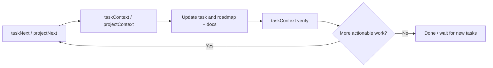

# Projitive

[](https://github.com/yinxulai/projitive/actions/workflows/mcp-lint-test.yml)
[](https://github.com/yinxulai/projitive/actions/workflows/mcp-release.yml)
[](https://www.npmjs.com/package/@projitive/mcp)
[](https://www.npmjs.com/package/@projitive/mcp)

Language: English | [简体中文](README_CN.md)

Projitive is a governance model and MCP toolchain for Agent-driven delivery.

It helps teams turn "AI can code" into "AI can continuously deliver with traceability".

## Version

- Current spec: projitive-spec v1.0.0
- MCP package: @projitive/mcp (2.x line)

## 60-Second Start

If you only read one section, read this:

1. Start MCP: `npx -y @projitive/mcp`
2. Configure scan roots and depth in your MCP client
3. Run the loop: taskNext -> taskContext -> taskUpdate -> taskContext -> taskNext

Why teams use it:

- Faster next-task selection
- Clearer evidence traceability
- More stable multi-agent delivery loops

## 5-Minute Demo (Copy/Paste)

Use this quick flow to experience the full loop: auto task discovery -> execution gate -> state write-back.

1. Start MCP server

```bash
npx -y @projitive/mcp
```

2. Connect Projitive MCP in your agent client

```json
{
  "mcpServers": {
    "projitive": {
      "command": "npx",
      "args": ["-y", "@projitive/mcp"]
    }
  }
}
```

3. Run this minimal loop

```text
taskNext
taskContext
taskUpdate
taskContext
taskNext
```

4. If no actionable task exists

```text
taskCreate
taskNext
```

Expected result: the system does not stall on "no tasks" and helps the agent create and continue actionable work.

## Why Use Projitive

Projitive turns agent execution from "can code" into "can continuously deliver." If you want an open-source governance loop that is practical, traceable, and sustainable in real projects, this is what it is built for.

- Your agent always gets a next best action, even when backlog quality is poor.
- Task state, roadmap state, and evidence stay aligned by design.
- Documentation is maintained during execution, not deferred to release week.
- New contributors can enter mid-cycle without breaking delivery rhythm.

## Typical Open-Source Usage Scenarios

### "Agent has nothing to do"

Instead of stalling, Projitive returns a discovery path and seed direction so the agent can create new actionable slices and keep moving.

### "Project setup is incomplete"

Projitive bootstraps governance baseline (store, views, doc tracks) and repairs missing artifacts in partially initialized projects.

### "Docs and execution drift apart"

Projitive enforces execution gates and context checks, so research, architecture decisions, and evidence links are updated as part of the same loop.

### "Too many projects, no priority"

Projitive ranks opportunities by actionable intensity and recency, so agents focus where delivery impact is highest first.

## How It Lands In Practice

### Default Delivery Loop



Recommended minimal sequence:

1. taskNext
2. taskContext
3. taskCreate/taskUpdate and/or roadmapCreate/roadmapUpdate
4. taskContext
5. taskNext

### Governance Status Model

| Status | Meaning | Valid transitions |
|---|---|---|
| `TODO` | Ready to start | -> `IN_PROGRESS`, `BLOCKED` |
| `IN_PROGRESS` | Actively executing | -> `BLOCKED`, `DONE` |
| `BLOCKED` | Cannot proceed | -> `TODO`, `IN_PROGRESS` |
| `DONE` | Completed with evidence | (terminal) |

`BLOCKED` tasks use structured blocker metadata (`type`, `description`, optional `blockingEntity` / `unblockCondition` / `escalationPath`) so unblocking can be automated.

## Install and Configure

Use the published MCP package directly:

```bash
npx -y @projitive/mcp
```

MCP client config example:

```json
{
  "mcpServers": {
    "projitive": {
      "command": "npx",
      "args": ["-y", "@projitive/mcp"],
      "env": {
        "PROJITIVE_SCAN_ROOT_PATHS": "/workspace/a:/workspace/b",
        "PROJITIVE_SCAN_MAX_DEPTH": "3"
      }
    }
  }
}
```

Environment variables (all optional):

| Variable | Default | Description |
|---|---|---|
| `PROJITIVE_SCAN_ROOT_PATHS` | `~` (home dir) | Discovery roots, platform path delimiter separated |
| `PROJITIVE_SCAN_ROOT_PATH` | — | Legacy single-root fallback if above is unset |
| `PROJITIVE_SCAN_MAX_DEPTH` | `3` | Discovery depth, integer 0–8 |

## Deep-Dive Docs

For complete parameters and concrete call examples:

- packages/mcp/README.md
- packages/mcp/README_CN.md

## Repo Map

- designs/: spec and conventions
- packages/mcp/: MCP server implementation
- packages/skills/: skill package and helpers

## Read Next

- User-facing MCP guide: packages/mcp/README.md
- Chinese MCP guide: packages/mcp/README_CN.md
- Spec overview: designs/README.md
- Chinese spec docs: designs/README_CN.md

## Language Policy

- English is default
- Chinese documents use _CN suffix
