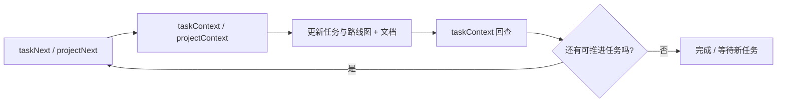

# Projitive

语言：简体中文 | [English](README.md)

Projitive 是一套面向 Agent 交付的治理模型与 MCP 工具链。

它帮助团队把“AI 会写代码”变成“AI 可以持续推进并且可追溯交付”。

## 版本信息

- 当前规范：projitive-spec v1.0.0
- MCP 包：@projitive/mcp（2.x 版本线）

## 60 秒上手

如果你只看一段，请看这里：

1. 启动 MCP：`npx -y @projitive/mcp`
2. 在客户端配置扫描根目录和深度
3. 按闭环调用：taskNext -> taskContext -> taskUpdate -> taskContext -> taskNext

你会立刻得到：

- 更快的下一任务选择
- 更清晰的证据链
- 更稳定的多 Agent 推进流程

## 使用后能达到的效果

接入后，团队通常会在第一个迭代周期内获得以下收益：

- 新任务识别和创建更快：无可执行任务时可直接通过 taskCreate/roadmapCreate 补齐执行入口。
- 状态一致性更高：任务与路线图状态变更可回查、可验证、可追踪。
- 交付节奏更稳定：发现 -> 执行 -> 验证 -> 再排序形成可持续闭环。
- 上手门槛更低：新成员可按固定调用序列快速进入稳定执行流。

重点：配合自主推进型 Agent，例如 OpenClaw 效果最佳！

## 它解决什么问题

多数 Agent 流程的问题不在“不会编码”，而在“无法长期稳定推进项目状态”。

Projitive 用 4 个约束解决这个问题：

- 状态优先：任务状态清晰（`TODO`、`IN_PROGRESS`、`BLOCKED`、`DONE`）
- 证据优先：状态变化应有 designs/report/readme 等证据
- 上下文优先：执行前先定位治理根
- 闭环优先：发现 -> 执行 -> 验证 -> 重新排序

## 默认推进闭环



推荐最短链路：

1. taskNext
2. taskContext
3. taskCreate/taskUpdate 和/或 roadmapCreate/roadmapUpdate
4. taskContext
5. taskNext

## 安装与配置

直接使用已发布包：

```bash
npx -y @projitive/mcp
```

MCP 客户端配置示例：

```json
{
  "mcpServers": {
    "projitive": {
      "command": "npx",
      "args": ["-y", "@projitive/mcp"],
      "env": {
        "PROJITIVE_SCAN_ROOT_PATHS": "/workspace/a:/workspace/b",
        "PROJITIVE_SCAN_MAX_DEPTH": "3"
      }
    }
  }
}
```

必填环境变量：

- PROJITIVE_SCAN_ROOT_PATHS：扫描根目录（按平台分隔符拼接）
- PROJITIVE_SCAN_MAX_DEPTH：扫描深度（0-8）

回退策略：若未设置 PROJITIVE_SCAN_ROOT_PATHS，会回退到旧变量 PROJITIVE_SCAN_ROOT_PATH。

## 仓库导航

- designs/：规范与设计文档
- packages/mcp/：MCP 服务端实现
- packages/skills/：技能包与工具脚本

## 下一步阅读

- MCP 用户文档：[packages/mcp/README_CN.md](packages/mcp/README_CN.md)
- MCP 英文文档：[packages/mcp/README.md](packages/mcp/README.md)
- 规范入口：[designs/README_CN.md](designs/README_CN.md)
- 英文规范入口：[designs/README.md](designs/README.md)

## 语言规则

- 默认英文
- 中文文档使用 _CN 后缀
