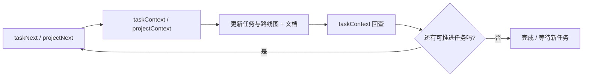

# Projitive

[](https://github.com/yinxulai/projitive/actions/workflows/mcp-lint-test.yml)
[](https://github.com/yinxulai/projitive/actions/workflows/mcp-release.yml)
[](https://www.npmjs.com/package/@projitive/mcp)
[](https://www.npmjs.com/package/@projitive/mcp)

语言：简体中文 | [English](README.md)

Projitive 是一套面向 Agent 交付的治理模型与 MCP 工具链。

它帮助团队把“AI 会写代码”变成“AI 可以持续推进并且可追溯交付”。

## 版本信息

- 当前规范：projitive-spec v1.0.0
- MCP 包：@projitive/mcp（2.x 版本线）

## 60 秒上手

如果你只看一段，请看这里：

1. 启动 MCP：`npx -y @projitive/mcp`
2. 在客户端配置扫描根目录和深度
3. 按闭环调用：taskNext -> taskContext -> taskUpdate -> taskContext -> taskNext

你会立刻得到：

- 更快的下一任务选择
- 更清晰的证据链
- 更稳定的多 Agent 推进流程

## 5 分钟演示（可直接复制）

下面这组步骤用于快速体验“自动找任务 -> 执行门禁 -> 状态回写”的完整闭环。

1. 启动 MCP 服务

```bash
npx -y @projitive/mcp
```

2. 在你的 Agent 客户端连接 Projitive MCP

```json
{
  "mcpServers": {
    "projitive": {
      "command": "npx",
      "args": ["-y", "@projitive/mcp"]
    }
  }
}
```

3. 依次调用下面的最短链路

```text
taskNext
taskContext
taskUpdate
taskContext
taskNext
```

4. 如果当前没有可执行任务

```text
taskCreate
taskNext
```

你会看到：系统不会停在“没任务”，而是引导 Agent 自动补任务并继续推进。

## 为什么要用 Projitive

Projitive 的核心价值不是“再多一个工具”，而是把 Agent 执行从“能写代码”升级为“能持续交付”。如果你在找一套开源、可落地、可持续维护的 Agent 治理方式，它就是为这件事设计的。

- Agent 永远有下一步动作，不会因为任务不清晰就空转。
- 任务状态、路线图状态、证据链天然保持一致。
- 文档在执行过程中被持续维护，而不是最后集中补。
- 新成员中途接入也能按同一套节奏推进。

## 典型开源使用场景

### 当 Agent 无事可做

系统不会只返回“没有任务”，而是先检查当前分支最新代码和用户最近动作；若这些变化尚未同步到 task/roadmap/report，再先做治理同步，然后给出发现路径和任务种子，让 Agent 在同一轮补出可执行切片并继续推进。

### 当项目初始化不完整

系统自动补齐治理基线（存储、视图、文档轨道），把半成品项目拉到可持续交付状态。

### 当执行和文档容易脱节

系统通过执行门禁和上下文回查，强制在推进任务时同步更新调研、设计决策和证据链接。

### 当多个项目抢优先级

系统按可执行强度和最近活跃度排序，让 Agent 先投入影响最大的项目，减少上下文切换浪费。

## 如何落地到日常流程

### 默认推进闭环



推荐最短链路：

1. taskNext
2. taskContext
3. taskCreate/taskUpdate 和/或 roadmapCreate/roadmapUpdate
4. taskContext
5. taskNext

### 治理状态模型

| 状态 | 含义 | 有效转换 |
|---|---|---|
| `TODO` | 待开始 | -> `IN_PROGRESS`、`BLOCKED` |
| `IN_PROGRESS` | 执行中 | -> `BLOCKED`、`DONE` |
| `BLOCKED` | 无法推进 | -> `TODO`、`IN_PROGRESS` |
| `DONE` | 已完成（有证据） | （终态） |

`BLOCKED` 任务要求结构化 `blocker` 元数据（`type`、`description`，可选 `blockingEntity` / `unblockCondition` / `escalationPath`），便于自动解锁和升级处理。

## 安装与配置

直接使用已发布包：

```bash
npx -y @projitive/mcp
```

MCP 客户端配置示例：

```json
{
  "mcpServers": {
    "projitive": {
      "command": "npx",
      "args": ["-y", "@projitive/mcp"],
      "env": {
        "PROJITIVE_SCAN_ROOT_PATHS": "/workspace/a:/workspace/b",
        "PROJITIVE_SCAN_MAX_DEPTH": "3"
      }
    }
  }
}
```

环境变量（均为可选）：

| 变量 | 默认值 | 说明 |
|---|---|---|
| `PROJITIVE_SCAN_ROOT_PATHS` | `~`（用户主目录）| 扫描根目录，按平台路径分隔符拼接多个 |
| `PROJITIVE_SCAN_ROOT_PATH` | — | 旧版单根回退，`PROJITIVE_SCAN_ROOT_PATHS` 未设时使用 |
| `PROJITIVE_SCAN_MAX_DEPTH` | `3` | 扫描深度，整数 0–8 |

## 深入文档

完整参数与调用示例请看：

- [packages/mcp/README_CN.md](packages/mcp/README_CN.md)
- [packages/mcp/README.md](packages/mcp/README.md)

## 仓库导航

- designs/：规范与设计文档
- packages/mcp/：MCP 服务端实现
- packages/skills/：技能包与工具脚本

## 下一步阅读

- MCP 用户文档：[packages/mcp/README_CN.md](packages/mcp/README_CN.md)
- MCP 英文文档：[packages/mcp/README.md](packages/mcp/README.md)
- 规范入口：[designs/README_CN.md](designs/README_CN.md)
- 英文规范入口：[designs/README.md](designs/README.md)

## 语言规则

- 默认英文
- 中文文档使用 _CN 后缀
