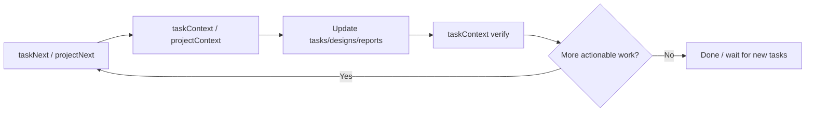

# @projitive/mcp

Language: English | [简体中文](README_CN.md)

**Current Spec Version: projitive-spec v1.0.0 | MCP Version: 1.0.8**

Projitive MCP server (semantic interface edition) helps agents discover projects, select tasks, locate evidence, and execute under governance workflows.

## Agent Delivery Loop



## Why Developers Choose This MCP

- Predictable API family: `List/Context` as core, `Next/Scan/Locate` for acceleration.
- Governance-safe automation: state changes are guided by evidence-first workflow.
- Agent-ready outputs: markdown contracts optimized for tool-chaining, not raw JSON blobs.
- Production publishing pipeline: release-triggered CI with lint/test/publish gates.

## How It Helps Agents Manage and Advance Projects

This MCP is designed to make agent execution operational, not just informative. It gives agents a closed-loop workflow:

1. **Find what to do next**
  - `taskNext` or `projectNext` ranks actionable targets.
2. **Build the right context**
  - `taskContext` / `projectContext` / `roadmapContext` provide evidence, references, and next-call hints.
3. **Execute with governance constraints**
  - Agent updates markdown artifacts (`tasks.md`, `designs/`, `reports/`) with immutable IDs and evidence rules.
4. **Re-verify and continue**
  - Re-run `taskContext` (or `roadmapContext`) to confirm consistency, then move to the next task.

In short: it converts agent work from ad-hoc edits into a **discover → decide → execute → verify** delivery loop.

## Agent Workflow (Shortest Path)

```text
taskNext
  -> taskContext
  -> update artifacts (tasks/designs/reports)
  -> taskContext (verify)
  -> taskNext (next cycle)
```

When no actionable task exists (`actionableTasks: 0`), use bootstrap path:

```text
taskNext
  -> projectContext
  -> create 1-3 TODO tasks in tasks.md marker block (from roadmap/readme/report gaps)
  -> taskNext
```

Optional customization: add `hooks/task_no_actionable.md` in governance root to override the default no-task discovery checklist.

When the agent starts inside a project:

```text
projectLocate -> projectContext -> taskList -> taskContext
```

## Quick Start

Use npm package directly in MCP client configuration:

```bash
npx -y @projitive/mcp
```

MCP client config example (`mcp.json`):

```json
{
  "mcpServers": {
    "projitive": {
      "command": "npx",
      "args": ["-y", "@projitive/mcp"],
      "env": {
        "PROJITIVE_SCAN_ROOT_PATH": "/absolute/path/to/your/workspace",
        "PROJITIVE_SCAN_MAX_DEPTH": "3"
      }
    }
  }
}
```

Environment variables (required):

- `PROJITIVE_SCAN_ROOT_PATH`: required scan root for discovery methods.
- `PROJITIVE_SCAN_MAX_DEPTH`: required scan depth for discovery methods (integer `0-8`).

Local path startup is not the recommended usage mode in this README.

For maintainers/contributors only:

```bash
cd packages/mcp
npm ci
npm run build
npm run test
```

## Spec Version

- Current aligned spec version: `projitive-spec v1.0.0`
- Note: Projitive is a general governance specification; MCP is one implementation of this spec.
- Alignment rule: MCP major version must match the spec major version (currently both `v1.x`).

## Design Boundaries

- MCP handles discovery, locating, summarization, and execution guidance.
- Agents/AI handle reading and updating markdown content.
- MCP does not provide direct artifact-write APIs such as `task.update_*`, `roadmap.update_*`, or `sync_*`.
- All tool outputs are agent-oriented Markdown (not raw JSON objects).
- Standard output sections: `Summary` / `Evidence` / `Agent Guidance` / `Next Call`.
- Standard error sections: `Error` / `Next Step` / `Retry Example`.

## MCP Capability Model

- Tools: execute discovery/locating/summarization actions (primary channel).
- Resources: expose readable governance artifacts for low-cost context loading.
- Prompts: provide parameterized workflow templates to reduce execution drift.

### Resources (Implemented)

- `projitive://governance/workspace`: reads `.projitive/README.md`
- `projitive://governance/tasks`: reads `.projitive/tasks.md`
- `projitive://governance/roadmap`: reads `.projitive/roadmap.md`
- `projitive://mcp/method-catalog`: method naming and role catalog (`List/Context/Next/Scan/Locate`)

### Prompts (Implemented)

- `executeTaskWorkflow`: standard execution chain (`taskNext -> taskContext -> artifacts update -> verify`)
- `updateTaskStatusWithEvidence`: status transition + evidence alignment template
- `triageProjectGovernance`: project-level governance triage template

## Tools Methods

### Discovery Layer

#### `projectInit`

- **Purpose**: manually initialize governance directory structure for a project (default `.projitive`).
- **Input**: `projectPath`, `governanceDir?`, `force?`
- **Output Example (Markdown)**:

```markdown
# projectInit

## Summary
- projectPath: /workspace/proj-a
- governanceDir: /workspace/proj-a/.projitive
- markerPath: /workspace/proj-a/.projitive/.projitive
- force: false

## Evidence
- createdFiles: 4
- updatedFiles: 0
- skippedFiles: 0

## Agent Guidance
- If files were skipped and you want to overwrite templates, rerun with force=true.
- Continue with projectContext and taskList for execution.

## Next Call
- projectContext(projectPath="/workspace/proj-a/.projitive")
```

#### `projectNext`

- **Purpose**: directly list recently actionable projects (ranked by actionable task count and recency).
- **Input**: `limit?`
- **Output Example (Markdown)**:

```markdown
# projectNext

## Summary
- rootPath: /workspace
- maxDepth: 3
- matchedProjects: 8
- actionableProjects: 3
- limit: 10

## Evidence
- rankedProjects:
1. /workspace/proj-a | actionable=5 | in_progress=2 | todo=3 | blocked=1 | done=4 | latest=2026-02-17T12:00:00.000Z | tasksPath=/workspace/proj-a/tasks.md
2. /workspace/proj-b | actionable=3 | in_progress=1 | todo=2 | blocked=0 | done=7 | latest=2026-02-16T09:00:00.000Z | tasksPath=/workspace/proj-b/tasks.md

## Agent Guidance
- Pick top 1 project and call `projectContext` with its governanceDir.
- Then call `taskList` and `taskContext` to continue execution.

## Next Call
- projectContext(projectPath="/workspace/proj-a")
```

#### `projectScan`

- **Purpose**: scan directories and discover governable projects.
- **Input**: `(none)`
- **Output Example (Markdown)**:

```markdown
# projectScan

## Summary
- rootPath: /workspace
- maxDepth: 3
- discoveredCount: 2

## Evidence
- projects:
1. /workspace/proj-a
2. /workspace/proj-b

## Agent Guidance
- Use one discovered project path and call `projectLocate` to lock governance root.
- Then call `projectContext` to inspect current governance state.

## Next Call
- projectLocate(inputPath="/workspace/proj-a")
```

#### `projectLocate`

- **Purpose**: when an agent is already inside a project path, resolve the nearest `.projitive` upward.
- **Input**: `inputPath`
- **Output Example (Markdown)**:

```markdown
# projectLocate

## Summary
- resolvedFrom: /workspace/proj-a/packages/mcp
- governanceDir: /workspace/proj-a
- markerPath: /workspace/proj-a/.projitive

## Agent Guidance
- Call `projectContext` with this governanceDir to get task and roadmap summaries.

## Next Call
- projectContext(projectPath="/workspace/proj-a")
```

#### `projectContext`

- **Purpose**: summarize governance state instead of only returning file lists.
- **Input**: `projectPath`
- **Output Example (Markdown)**:

```markdown
# projectContext

## Summary
- governanceDir: /workspace/proj-a
- tasksFile: /workspace/proj-a/tasks.md
- roadmapIds: 3

## Evidence
### Task Summary
- total: 12
- TODO: 4
- IN_PROGRESS: 3
- BLOCKED: 1
- DONE: 4

### Artifacts
- ✅ README.md
- ✅ roadmap.md
- ✅ tasks.md
- ✅ designs/
- ✅ reports/
- ✅ hooks/

## Agent Guidance
- Start from `taskList` to choose a target task.
- Then call `taskContext` with a task ID to retrieve evidence locations and reading order.

## Next Call
- taskList(projectPath="/workspace/proj-a")
```

### Task Layer

#### `taskNext`

- **Purpose**: one-step workflow for project discovery + best task selection + evidence/read-order output.
- **Input**: `limit?`
- **Output Example (Markdown)**:

```markdown
# taskNext

## Summary
- rootPath: /workspace
- maxDepth: 3
- matchedProjects: 8
- actionableTasks: 12
- selectedProject: /workspace/proj-a
- selectedTaskId: TASK-0003
- selectedTaskStatus: IN_PROGRESS

## Evidence
### Selected Task
- id: TASK-0003
- title: Build MCP tools
- taskLocation: /workspace/proj-a/tasks.md#L42

### Top Candidates
1. TASK-0003 | IN_PROGRESS | Build MCP tools | project=/workspace/proj-a | projectScore=6
2. TASK-0007 | TODO | Add docs examples | project=/workspace/proj-b | projectScore=5

### Selection Reason
- Rank rule: projectScore DESC -> taskPriority DESC -> taskUpdatedAt DESC.
- Selected candidate scores: projectScore=6, taskPriority=2, taskUpdatedAtMs=1739793600000.

### Suggested Read Order
1. /workspace/proj-a/tasks.md
2. /workspace/proj-a/designs/mcp-design.md
3. /workspace/proj-a/reports/mcp-progress.md

## Agent Guidance
- Start immediately with Suggested Read Order and execute the selected task.
- Re-run `taskContext` for the selectedTaskId after edits to verify evidence consistency.

## Next Call
- taskContext(projectPath="/workspace/proj-a", taskId="TASK-0003")
```

- **Recommended Path**: prefer `taskNext` to avoid multi-hop flow (`projectNext -> projectContext -> taskList -> taskContext`).

#### `taskList`

- **Purpose**: list tasks in current project, with optional status filtering and limiting.
- **Input**: `projectPath`, `status?`, `limit?`
- **Output Example (Markdown)**:

```markdown
# taskList

## Summary
- governanceDir: /workspace/proj-a
- tasksPath: /workspace/proj-a/tasks.md
- filter.status: IN_PROGRESS
- returned: 2

## Evidence
- tasks:
- TASK-0003 | IN_PROGRESS | Build MCP tools | owner=alice | updatedAt=2026-02-17T12:00:00.000Z
- TASK-0007 | IN_PROGRESS | Add docs examples | owner=bob | updatedAt=2026-02-17T13:30:00.000Z

## Agent Guidance
- Pick one task ID and call `taskContext`.

## Next Call
- taskContext(projectPath="/workspace/proj-a", taskId="TASK-0003")
```

#### `taskContext`

- **Purpose**: return task detail + related evidence locations in one call (replacing `trace.references`).
- **Input**: `projectPath`, `taskId`
- **Output Example (Markdown)**:

```markdown
# taskContext

## Summary
- governanceDir: /workspace/proj-a
- taskId: TASK-0003
- title: Build MCP tools
- status: IN_PROGRESS
- owner: alice
- updatedAt: 2026-02-17T12:00:00.000Z
- roadmapRefs: ROADMAP-0001
- taskLocation: /workspace/proj-a/tasks.md#L42

## Evidence
### Related Artifacts
- /workspace/proj-a/tasks.md
- /workspace/proj-a/designs/mcp-design.md
- /workspace/proj-a/reports/mcp-progress.md

### Reference Locations
- /workspace/proj-a/tasks.md#L42: "id": "TASK-0003"
- /workspace/proj-a/designs/mcp-design.md#L18: Ref: TASK-0003

### Suggested Read Order
1. /workspace/proj-a/tasks.md
2. /workspace/proj-a/designs/mcp-design.md
3. /workspace/proj-a/reports/mcp-progress.md

## Agent Guidance
- Read the files in Suggested Read Order.
- Verify whether current status and evidence are consistent.
- This task is IN_PROGRESS: prioritize finishing with report/design evidence updates.
- Verify references stay consistent before marking DONE.

## Next Call
- taskContext(projectPath="/workspace/proj-a", taskId="TASK-0003")
```

### Roadmap Layer

#### `roadmapList`

- **Purpose**: list roadmap items and linked task summary.
- **Input**: `projectPath`
- **Output Example (Markdown)**:

```markdown
# roadmapList

## Summary
- governanceDir: /workspace/proj-a
- roadmapCount: 2

## Evidence
- roadmaps:
- ROADMAP-0001 | linkedTasks=6
- ROADMAP-0002 | linkedTasks=3

## Agent Guidance
- Pick one roadmap ID and call `roadmapContext`.

## Next Call
- roadmapContext(projectPath="/workspace/proj-a", roadmapId="ROADMAP-0001")
```

#### `roadmapContext`

- **Purpose**: get single roadmap detail and reference locations.
- **Input**: `projectPath`, `roadmapId`
- **Output Example (Markdown)**:

```markdown
# roadmapContext

## Summary
- governanceDir: /workspace/proj-a
- roadmapId: ROADMAP-0001
- relatedTasks: 6
- references: 9

## Evidence
### Related Tasks
- TASK-0001 | DONE | Bootstrap governance
- TASK-0003 | IN_PROGRESS | Build MCP tools

### Reference Locations
- /workspace/proj-a/roadmap.md#L21: ROADMAP-0001
- /workspace/proj-a/tasks.md#L42: "roadmapRefs": ["ROADMAP-0001"]

## Agent Guidance
- Read roadmap references first, then related tasks.
- Keep ROADMAP/TASK IDs unchanged while updating markdown files.

## Next Call
- roadmapContext(projectPath="/workspace/proj-a", roadmapId="ROADMAP-0001")
```

## Unified Error Output Example

```markdown
# taskContext

## Error
- cause: Invalid task ID format: TASK-12

## Next Step
- expected format: TASK-0001
- retry with a valid task ID

## Retry Example
- taskContext(projectPath="/workspace/proj-a", taskId="TASK-0001")
```

## Recommended Agent Call Flow

1. `taskNext`: one-step discovery and top task selection (default path).
2. `taskContext`: fetch detailed evidence for a specific task ID when needed.
3. `projectNext`: optional project-level scheduling flow when you need project-first dispatch.
4. When already in a project path, use `projectLocate` to quickly resolve governance root.
