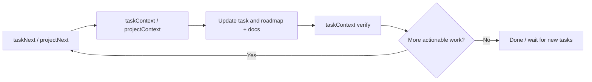
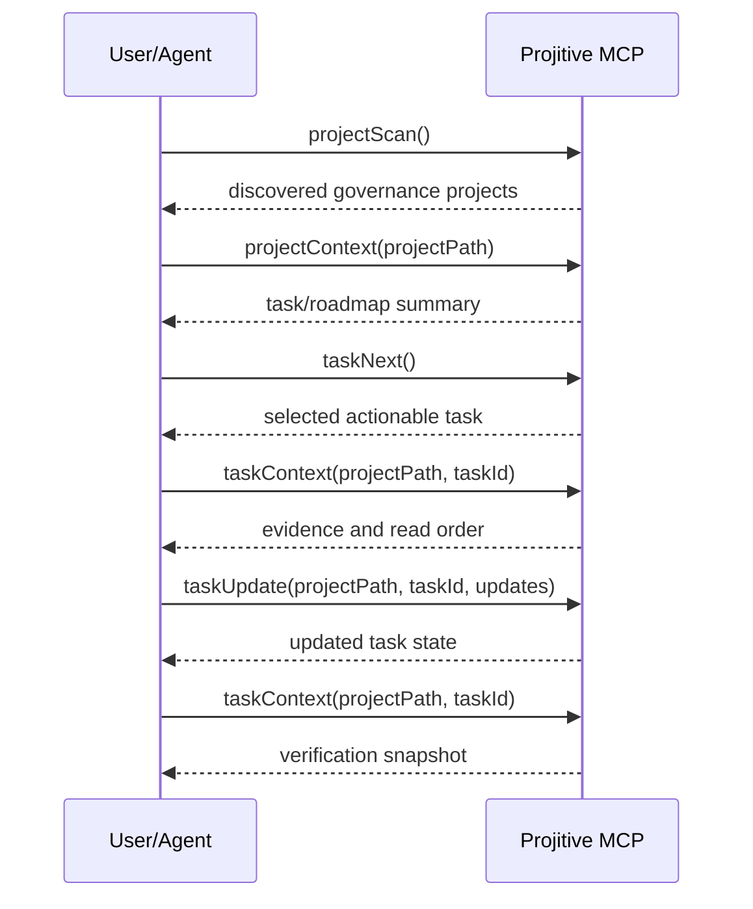

# @projitive/mcp

Language: English | [简体中文](README_CN.md)

## Version

- Current Spec Version: projitive-spec v1.0.0
- MCP Version: 2.0.0

## 60-Second Start

If you only read one section, read this:

1. Start server: `npx -y @projitive/mcp`
2. Configure mcp.json with scan roots and depth
3. Run: taskNext -> taskContext -> taskUpdate -> taskContext -> taskNext

Why teams use it:

- Faster next-task selection
- Better evidence traceability
- More predictable multi-agent delivery

## What It Is Useful For

Projitive MCP helps agents move work forward in governed projects without losing traceability.

- Pick the next highest-value task quickly.
- Build execution context with linked evidence.
- Update task and roadmap state in a consistent, auditable way.
- Keep delivery loop stable across long-running multi-agent workflows.

## How To Use

### 1. Start MCP Server

Use package directly in your MCP client:

```bash
npx -y @projitive/mcp
```

### 2. Add Client Config

Example mcp.json:

```json
{
  "mcpServers": {
    "projitive": {
      "command": "npx",
      "args": ["-y", "@projitive/mcp"],
      "env": {
        "PROJITIVE_SCAN_ROOT_PATHS": "/workspace/a:/workspace/b",
        "PROJITIVE_SCAN_MAX_DEPTH": "3"
      }
    }
  }
}
```

Required environment variables:

- PROJITIVE_SCAN_ROOT_PATHS: discovery roots (platform-delimited)
- PROJITIVE_SCAN_MAX_DEPTH: discovery depth (0-8)

Fallback: when PROJITIVE_SCAN_ROOT_PATHS is not set, legacy PROJITIVE_SCAN_ROOT_PATH is used.

### 3. Use The Default Delivery Loop


```mermaid
flowchart LR
  A[taskNext / projectNext] --> B[taskContext / projectContext]
  B --> C[Update task and roadmap + docs]
  C --> D[taskContext verify]
  D --> E{More actionable work?}
  E -->|Yes| A
  E -->|No| F[Done / wait for new tasks]
```

Recommended minimal sequence:

1. taskNext
2. taskContext
3. taskUpdate and/or roadmapUpdate
4. taskContext
5. taskNext

### 4. New User Minimal Flow

This is the shortest end-to-end path from first connection to first governed update:


```mermaid
sequenceDiagram
  participant U as User/Agent
  participant M as Projitive MCP

  U->>M: projectScan()
  M-->>U: discovered governance projects
  U->>M: projectContext(projectPath)
  M-->>U: task/roadmap summary
  U->>M: taskNext()
  M-->>U: selected actionable task
  U->>M: taskContext(projectPath, taskId)
  M-->>U: evidence and read order
  U->>M: taskUpdate(projectPath, taskId, updates)
  M-->>U: updated task state
  U->>M: taskContext(projectPath, taskId)
  M-->>U: verification snapshot
```

## What You Can Do With It

### Core Tools

| Group | Tool | Purpose |
| --- | --- | --- |
| Project | projectInit | Initialize governance structure |
| Project | projectScan | Discover governable projects |
| Project | projectNext | Rank actionable projects |
| Project | projectLocate | Resolve nearest governance root |
| Project | projectContext | Summarize governance context |
| Project | syncViews | Force materialize markdown views |
| Task | taskList | List tasks |
| Task | taskNext | Select best actionable task |
| Task | taskContext | Get task evidence and reading order |
| Task | taskUpdate | Update task state and metadata |
| Roadmap | roadmapList | List roadmaps and linked tasks |
| Roadmap | roadmapContext | Get roadmap context |
| Roadmap | roadmapUpdate | Update roadmap milestone fields |

### Resources

- projitive://governance/workspace
- projitive://governance/tasks
- projitive://governance/roadmap
- projitive://mcp/method-catalog

### Prompts

- executeTaskWorkflow
- updateTaskStatusWithEvidence
- triageProjectGovernance

## Design Philosophy

### 1. Source Of Truth vs Views

- Governance source data is stored in .projitive.
- tasks.md and roadmap.md are materialized/generated views.
- Manual edits on generated views can be overwritten by sync.

### 2. Query Performance Without Extra Files

- Query path uses embedded DuckDB in memory by default.
- No extra intermediate DuckDB database file is created.

### 3. Evidence-First Execution

- State changes should be backed by report/design/readme evidence.
- Tool output format is agent-friendly markdown for chained execution.

### 4. Deterministic Multi-Agent Workflow

- Prefer tool-based writes over ad-hoc markdown edits.
- Keep IDs stable and transitions explicit.
- Re-verify context after each significant update.

## Architecture Documents

- Index: docs/README_CN.md
- Current architecture: docs/ARCHITECTURE_CN.md
- Migration architecture: docs/MIGRATION_ARCHITECTURE_CN.md
- Historical proposals: REFACTOR_CN.md, REFACTOR_V2_CN.md

## Development

For maintainers:

```bash
cd packages/mcp
npm ci
npm run build
npm run test
```
