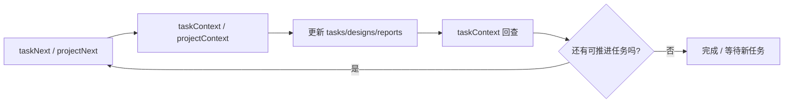

# @projitive/mcp

语言：简体中文 | [English](README.md)

**当前规范版本：projitive-spec v1.0.0 | MCP 版本：1.0.7**

Projitive MCP Server 是一套面向 Agent 的治理执行接口，帮助你在项目中稳定完成：发现上下文、选择任务、读取证据、持续推进。

## Agent 推进闭环



## 为什么开发者会用它

- 命名统一：核心 `List/Context`，加速 `Next/Scan/Locate`。
- 可控自动化：围绕状态与证据约束推进，降低“改了但不可追溯”的风险。
- Agent 友好输出：统一 Markdown 结构（Summary / Evidence / Agent Guidance / Next Call）。
- 可发布可运维：已具备 release 触发的 CI 发布流程。

## 它如何帮助 Agent 管理并推进项目

这个 MCP 的目标不是“给信息”，而是“让 Agent 稳定推进交付”。

它把 Agent 的工作变成可闭环流程：

1. **先找到最该做的事**
	- 用 `taskNext` 或 `projectNext` 自动排序出可推进目标。
2. **再拿到可执行上下文**
	- 用 `taskContext` / `projectContext` / `roadmapContext` 获取证据、引用和下一步调用建议。
3. **按治理规则执行更新**
	- Agent 更新 `tasks.md`、`designs/`、`reports/`，并遵守 ID 不可变与证据约束。
4. **回查一致性后继续下一轮**
	- 重新调用 `taskContext`（或 `roadmapContext`）确认一致，再进入下一任务。

本质上，它把 Agent 执行从零散改动变成 **发现 → 决策 → 执行 → 验证** 的持续推进机制。

## Agent 最短执行路径

```text
taskNext
  -> taskContext
  -> 更新工件（tasks/designs/reports）
  -> taskContext（回查）
  -> taskNext（进入下一轮）
```

当没有可执行任务（`actionableTasks: 0`）时，使用启动路径：

```text
taskNext
  -> projectContext
  -> 在 tasks.md 标记区基于 roadmap/readme/report 缺口新增 1-3 个 TODO 任务
  -> taskNext
```

可选：在治理根目录添加 `hooks/task_no_actionable.md`，可覆盖默认的“无任务发现清单”。

如果 Agent 已在项目目录内：

```text
projectLocate -> projectContext -> taskList -> taskContext
```

## 快速开始

建议直接通过 npm 包方式在 MCP 客户端使用：

```bash
npx -y @projitive/mcp
```

MCP 客户端配置示例（`mcp.json`）：

```json
{
  "mcpServers": {
    "projitive": {
      "command": "npx",
      "args": ["-y", "@projitive/mcp"],
      "env": {
        "PROJITIVE_SCAN_ROOT_PATH": "/你的工作区绝对路径",
        "PROJITIVE_SCAN_MAX_DEPTH": "3"
      }
    }
  }
}
```

环境变量说明（必填）：

- `PROJITIVE_SCAN_ROOT_PATH`：扫描/发现方法使用的根目录。
- `PROJITIVE_SCAN_MAX_DEPTH`：扫描/发现方法使用的深度（整数 `0-8`）。

本 README 不建议本地路径方式启动。

仅维护者/贡献者开发时可用：

```bash
cd packages/mcp
npm ci
npm run build
npm run test
```

## MCP 能力机制

- Tools：执行发现、定位、汇总、分诊。
- Resources：提供治理上下文资源，便于 Agent 低成本加载背景。
- Prompts：提供参数化执行模板，降低流程偏差。

### Resources（已实现）

- `projitive://governance/workspace`
- `projitive://governance/tasks`
- `projitive://governance/roadmap`
- `projitive://mcp/method-catalog`

### Prompts（已实现）

- `executeTaskWorkflow`
- `updateTaskStatusWithEvidence`
- `triageProjectGovernance`

## 方法总览

| 分组 | 方法 | 作用 |
|---|---|---|
| Project | `projectInit` | 初始化治理目录结构（默认 `.projitive`） |
| Project | `projectScan` | 扫描治理项目 |
| Project | `projectNext` | 选择最可推进项目 |
| Project | `projectLocate` | 定位治理根目录 |
| Project | `projectContext` | 汇总项目治理上下文 |
| Task | `taskList` | 列任务（可过滤） |
| Task | `taskNext` | 选择最可执行任务 |
| Task | `taskContext` | 单任务详情与证据定位 |
| Roadmap | `roadmapList` | 列路线图与关联任务 |
| Roadmap | `roadmapContext` | 单路线图详情与引用定位 |

参数约束（重要）：

- `projectInit` 必须显式传入 `projectPath`，避免误在工作区根目录初始化。
- `projectNext` 与 `taskNext` 不再支持 `rootPath` 入参，扫描根目录统一由 `PROJITIVE_SCAN_ROOT_PATH` 控制。

## 语言切换

- 英文完整文档：`README.md`
- 中文文档：`README_CN.md`

> 说明：英文文档包含更完整的分方法示例与返回样例；中文文档用于快速上手与日常查阅。
