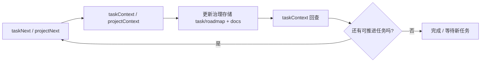
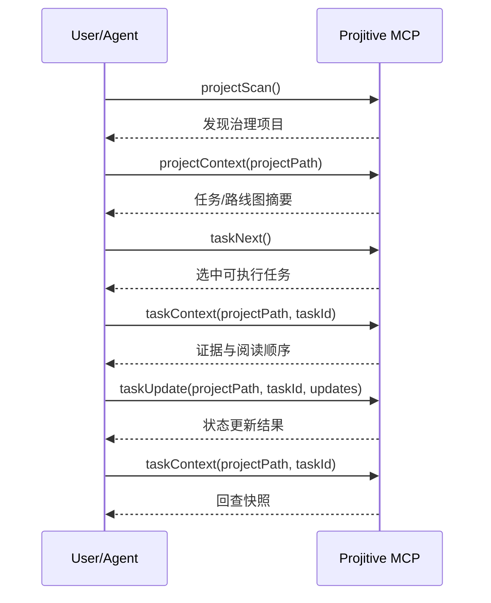

# @projitive/mcp

语言：简体中文 | [English](README.md)

## 版本信息

- 当前规范版本：projitive-spec v1.0.0
- MCP 版本：2.0.1

## 60 秒上手

如果你只看一段，就看这里：

1. 启动：`npx -y @projitive/mcp`
2. 配置 mcp.json（扫描根目录 + 深度）
3. 调用：taskNext -> taskContext -> taskUpdate -> taskContext -> taskNext

你会立刻得到：

- 更快的下一任务选择
- 更清晰的证据链
- 更稳定的多 Agent 推进

## 使用后能达到的效果

接入后，通常可以快速获得以下价值：

- 在无可执行任务时，直接用 taskCreate/roadmapCreate 补齐执行入口，减少空转。
- 任务与路线图状态可持续回查，减少多 Agent 协作中的状态漂移。
- 通过标准闭环保持推进节奏，减少“做了很多但不可验证”的情况。
- 新成员可按固定调用链快速进入稳定交付模式。

重点：配合自主推进型 Agent，例如 OpenClaw 效果最佳！

Projitive MCP Server 是一套面向 Agent 的治理执行接口，帮助你在项目中稳定完成：发现上下文、选择任务、读取证据、持续推进。

## 有什么用

它解决的是“AI 能写代码，但项目推进混乱和不可追溯”的问题。

- 快速找到下一步最该做的任务。
- 自动拿到执行任务所需上下文和证据线索。
- 统一更新任务与路线图状态，避免状态漂移。
- 让多轮、多 Agent 协作保持稳定推进。

## 怎么用

### 1. 启动 MCP

建议直接通过 npm 包方式在 MCP 客户端使用：

```bash
npx -y @projitive/mcp
```

### 2. 配置 mcp.json

MCP 客户端配置示例：

```json
{
  "mcpServers": {
    "projitive": {
      "command": "npx",
      "args": ["-y", "@projitive/mcp"],
      "env": {
        "PROJITIVE_SCAN_ROOT_PATHS": "/workspace/a:/workspace/b",
        "PROJITIVE_SCAN_MAX_DEPTH": "3"
      }
    }
  }
}
```

环境变量说明（必填）：

- PROJITIVE_SCAN_ROOT_PATHS：扫描根目录列表（按平台分隔符拼接）。
- PROJITIVE_SCAN_MAX_DEPTH：扫描深度（0-8）。

回退策略：若未设置 PROJITIVE_SCAN_ROOT_PATHS，会回退到旧变量 PROJITIVE_SCAN_ROOT_PATH。

### 3. 按默认推进闭环使用


```mermaid
flowchart LR
  A[taskNext / projectNext] --> B[taskContext / projectContext]
  B --> C[更新治理存储 task/roadmap + docs]
  C --> D[taskContext 回查]
  D --> E{还有可推进任务吗?}
  E -->|是| A
  E -->|否| F[完成 / 等待新任务]
```

推荐最短路径：

1. taskNext
2. taskContext
3. taskCreate/taskUpdate 和/或 roadmapCreate/roadmapUpdate
4. taskContext（回查）
5. taskNext（继续下一轮）

### 4. 新用户最小闭环示例

这是从首次连接到首次受治理更新的最短完整路径：


```mermaid
sequenceDiagram
  participant U as User/Agent
  participant M as Projitive MCP

  U->>M: projectScan()
  M-->>U: 发现治理项目
  U->>M: projectContext(projectPath)
  M-->>U: 任务/路线图摘要
  U->>M: taskNext()
  M-->>U: 选中可执行任务
  U->>M: taskContext(projectPath, taskId)
  M-->>U: 证据与阅读顺序
  U->>M: taskUpdate(projectPath, taskId, updates)
  M-->>U: 状态更新结果
  U->>M: taskContext(projectPath, taskId)
  M-->>U: 回查快照
```

## 能力总览

### 核心工具

| 分组 | 方法 | 作用 |
| --- | --- | --- |
| Project | projectInit | 初始化治理结构 |
| Project | projectScan | 扫描治理项目 |
| Project | projectNext | 选择最可推进项目 |
| Project | projectLocate | 定位治理根目录 |
| Project | projectContext | 汇总项目治理上下文 |
| Project | syncViews | 强制物化 markdown 视图 |
| Task | taskList | 列任务 |
| Task | taskNext | 选择最可执行任务 |
| Task | taskContext | 单任务详情与证据定位 |
| Task | taskCreate | 创建任务 |
| Task | taskUpdate | 更新任务状态与元数据 |
| Roadmap | roadmapList | 列路线图与关联任务 |
| Roadmap | roadmapContext | 单路线图详情 |
| Roadmap | roadmapCreate | 创建路线图里程碑 |
| Roadmap | roadmapUpdate | 更新路线图里程碑 |

### Resources

- projitive://governance/workspace
- projitive://governance/tasks
- projitive://governance/roadmap
- projitive://mcp/method-catalog

### Prompts

- executeTaskWorkflow
- updateTaskStatusWithEvidence
- triageProjectGovernance

## 设计理念

### 1. 源数据与视图分离

- 治理源数据存储在 .projitive。
- tasks.md 与 roadmap.md 是可重建视图。
- 手工改视图可能被后续同步覆盖。

### 2. 默认内嵌 DuckDB 查询

- 查询路径默认使用内嵌 DuckDB 内存引擎。
- 不产生额外 DuckDB 中间数据库文件。

### 3. 证据优先

- 状态变更应有 reports/designs/readme 等证据支撑。
- 工具输出保持 Agent 友好结构，便于链式调用。

### 4. 可预测的多 Agent 推进

- 优先使用工具写入，避免随意改表格型 markdown。
- ID 稳定、状态跃迁明确、每轮可回查。

## 架构文档

- docs/README_CN.md
- docs/ARCHITECTURE_CN.md
- docs/MIGRATION_ARCHITECTURE_CN.md
- REFACTOR_CN.md
- REFACTOR_V2_CN.md

## 开发说明

仅维护者/贡献者开发时可用：

```bash
cd packages/mcp
npm ci
npm run build
npm run test
```
