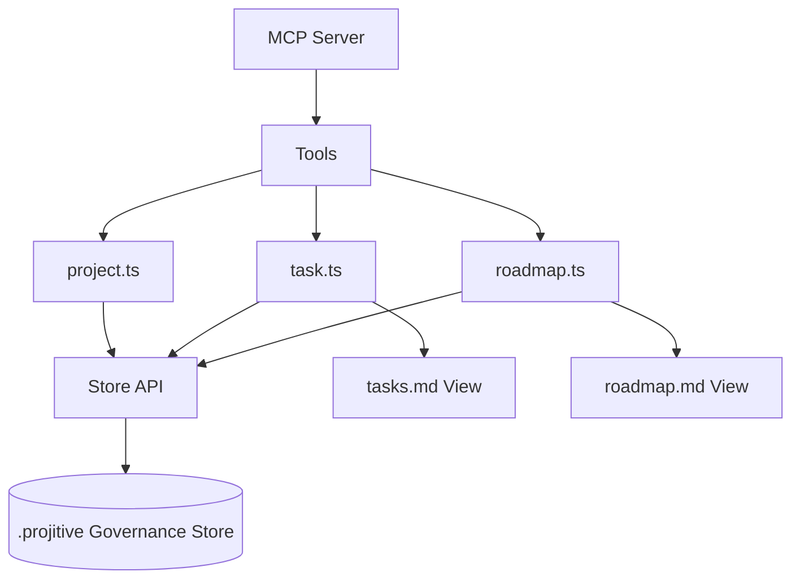
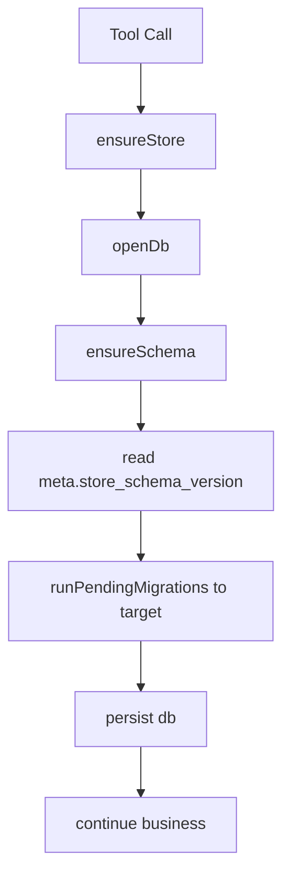
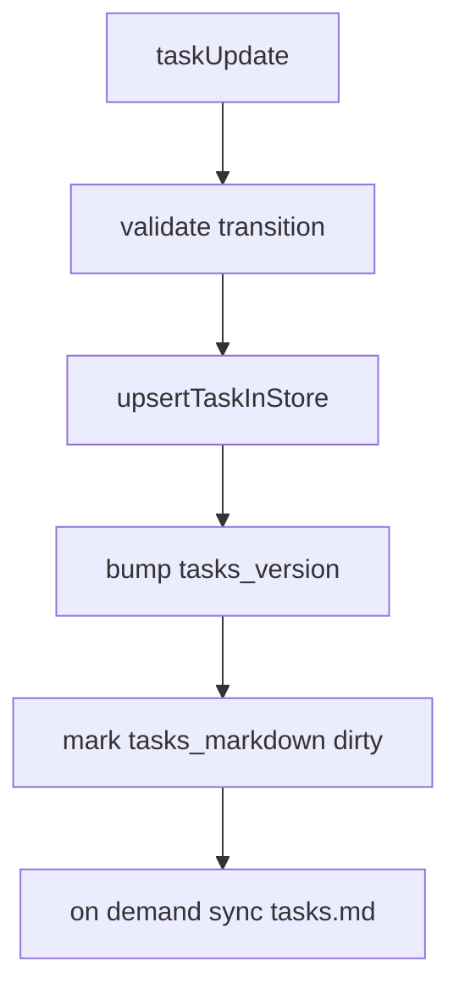
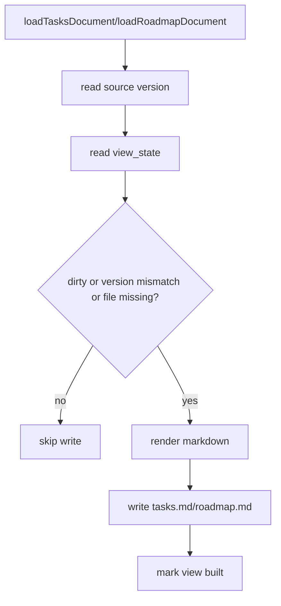

# Projitive MCP 当前架构（governance-store-first）

## 1. 目标与边界

当前版本的核心目标：

- 使用 `.projitive` 作为治理主存储。
- `tasks.md` / `roadmap.md` 仅作为可重建视图。
- MCP 工具输出面向 Agent 工作流，不暴露数据库文件路径细节。

非目标：

- 不再支持 Markdown 反向解析回写数据库。
- 不在工具响应中暴露数据库文件路径。

## 2. 逻辑分层

分层职责：

- 接入层：`source/index.ts`，注册工具、资源、提示词。
- 工具层：`source/tools/*.ts`，负责流程编排、lint 建议、上下文组合。
- 存储层：`source/common/store.ts`，负责 schema、查询、事务与持久化。
- 视图层：`tasks.md` / `roadmap.md`，由数据库按需物化。

## 3. 数据模型（现状）

### 3.1 表定义

- `tasks`
  - 业务列：`id/title/status/owner/summary/updated_at/links_json/roadmap_refs_json/sub_state_json/blocker_json`
  - 版本列：`record_version`

- `roadmaps`
  - 业务列：`id/title/status/time/updated_at`
  - 版本列：`record_version`

- `meta`
  - 业务列：`key/value`
  - 版本列：`record_version`

- `view_state`
  - 业务列：`name/dirty/last_source_version/last_built_at`
  - 版本列：`record_version`

- `migration_history`
  - 业务列：`id/from_version/to_version/checksum/started_at/finished_at/status/error_message`
  - 用途：记录每次迁移执行结果，用于审计与故障追踪

### 3.2 版本语义

- `meta.tasks_version` / `meta.roadmaps_version`
  - 逻辑源版本，用于判断 markdown 视图是否落后。
- `meta.store_schema_version`
  - schema 版本，用于自动迁移。
- `*.record_version`
  - 行级版本，记录该行被更新次数。

## 4. 核心运行流程

### 4.1 启动与存储准备

### 4.2 任务更新

### 4.3 视图同步（惰性）

## 5. 设计约束

- 数据唯一事实源：.projitive governance store。
- markdown 只读语义：手工编辑会被覆盖。
- 工具响应隐私：不返回 `.projitive` 的具体文件路径。
- 写入原子性：更新路径使用事务封装。

## 6. 推荐演进

- 将复杂 SQL 从工具层继续收敛到 read model。
- 为 `task/roadmap` 增加更细粒度 patch 接口。
- 增加迁移 dry-run 与可观测指标（迁移耗时、回退次数）。
