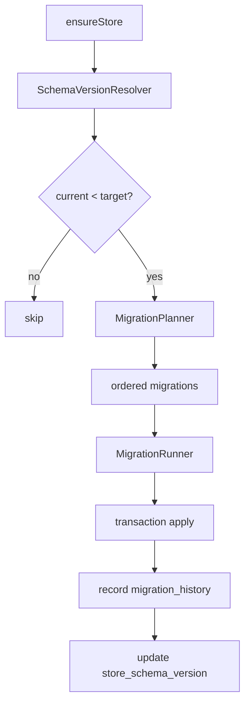
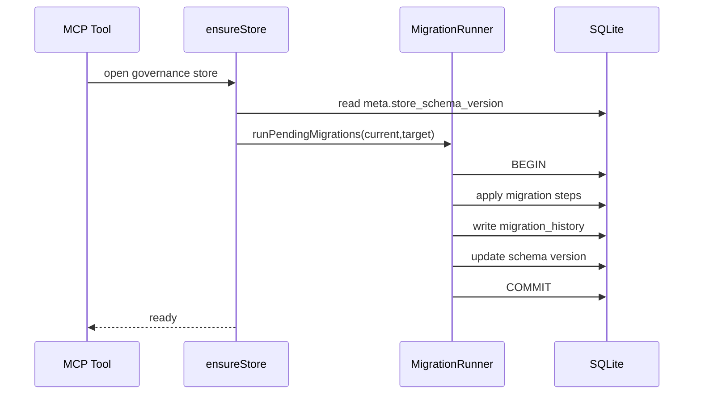

# Projitive MCP 自动迁移架构设计

## 1. 设计目标

为 SQLite 治理库提供可持续的自动升级能力，确保：

- 新版本 MCP 启动时可自动识别并升级旧库。
- 迁移过程具备幂等性、可回滚性、可审计性。
- 业务工具无需感知迁移细节。

## 2. 版本治理模型

使用双层版本：

- Schema 版本（库级）
  - `meta.store_schema_version`
  - 表示数据库结构版本。

- Record 版本（行级）
  - `*.record_version`
  - 表示行级更新次数，不参与 schema 判定。

迁移历史表（已实现）：

- `migration_history`
  - `id`：迁移编号（如 `20260313_add_record_version`）
  - `from_version` / `to_version`
  - `checksum`
  - `started_at` / `finished_at`
  - `status`（`SUCCESS`/`FAILED`）
  - `error_message`

## 3. 迁移执行器架构

组件定义：

- `SchemaVersionResolver`
  - 读取当前版本，解析目标版本。
- `MigrationPlanner`
  - 计算需要执行的 migration 列表。
- `MigrationRunner`
  - 按顺序执行，失败即停止。
- `MigrationRegistry`
  - 存放每个迁移脚本的元数据与 `up/down`。

## 4. 迁移脚本规范

每个 migration 需满足：

- 唯一 ID + checksum。
- 显式声明 `fromVersion -> toVersion`。
- 提供 `up(db)`，可选 `down(db)`。
- 可重复执行不破坏数据（幂等）。

当前目录：

- `source/common/migrations/`
  - `types.ts`（迁移类型定义）
  - `runner.ts`（执行器）
  - `steps.ts`（分步迁移注册）

## 5. 启动时序设计

## 6. 失败恢复策略

- 单步事务：每个 migration 作为原子事务执行。
- 失败即停：不继续后续 migration。
- 启动可重试：下次启动继续从未完成版本执行。
- 审计可追踪：`migration_history` 保留失败详情。

## 7. 兼容性与发布策略

- 兼容窗口：新版本至少兼容最近 2 个 schema 版本。
- 发布约束：
  - 先发布支持双版本读写的代码。
  - 再发布结构迁移。
  - 最后清理旧逻辑。

## 8. 与当前实现的衔接

当前已具备：

- `meta.store_schema_version`（库级版本）
- `tasks/roadmaps/meta/view_state.record_version`（行级版本）
- `migration_history` 迁移审计表
- `MigrationRunner` + `MIGRATION_STEPS` 自动执行 pending migrations
- 启动后自动持久化，确保迁移结果落盘

下一步建议：

1. 为每个 migration step 增加可验证 checksum 生成策略。
2. 增加迁移 dry-run（测试环境）与 explain 输出。
3. 补充迁移观测指标（耗时、失败率、重试次数）。
